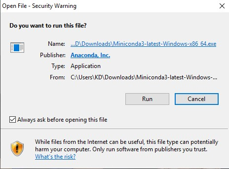

# python_dataviz
### นางสาวนพภเกตุน์ คนคง
### รหัสนักศึกษา 603021868-3
### วิธีการใช้งานโปรแกรม Python 
### 1.ดาวน์โหลดไฟล์ติดตั้งของPythonจาก https://docs.conda.io/
### 2.ลือก "Python 3.7" จากนั้นกด "Download"

### 3.เมื่อโปรแกรมดาวน์โหลดเสร็จ จะขึ้นหน้าต่างการติดตั้ง ให้เราเลือกติดตั้งโปรแกรมลงเครื่อง

### 4.หลังจากนั้น ทดลองหาโปรแกรม Python ถ้าโปรแกรมแสดงขึ้นมาแสดงว่าโปรแกรมติดตั้งสำเร็จ
### 5.เปิดโปรแกรม Anaconda Prompt 

### 6.สร้างโฟลเดอร์ใหม่เพื่อใช้ในการใช้งาน Python 
### 7.หลังจากนั้นติดตั้ง conda install matplotib

### 8. หลังจากนั้นติดตั้ง conda install jupyter

### 9.หลังจากนั้นเอาไฟล์เข้าโดยการ cd แล้วตามด้วยชื่อไฟล์ หลังจากนั้นพิมพ์ jupyter notebook เพื่อเปิดใช้งาน

### 10.ใช้งานโปรแกรมโดยการเริ่มเขียนโปรแกรมโดยการเลือก new และเลือก Python 3

### 11.เปลี่ยนชื่อไฟล์ของงานโดยการ ไปกดที่คำว่า File และเลือกคำว่า Rename หลังจากนั้นตั้งชื่อไฟล์ตามที่เราต้องการทดลองพิมพ์คำสั่ง print(“Hello”) และชื่อ ตามด้วยรหัสนักศึกษา แล้ว Run ด้วย Control+ Enter  

### วิธีการใช้งานโปรแกรม Colab
### 1.เข้าใช้งานโปรแกรมโดยการไปที่เว็บไซต์ https://colab.research.google.com/
### 2.หลังจากนั้น Loginด้วย E-mail addressเพื่อเข้าใช้งานโปรแกรม หลังจากLogin เสร็จจะแสดงหน้าดังนี้
 
### 3.หลังจากนั้นจะเขียนโปรแกรมโดยการไปที่คำว่า File และเลือกคำว่า New Python3 notebook เพื่อใช้งานการเขียนโปรแกรมบนColab หลังจากนั้นทำการ Import pandas และเขียนคำสั่งที่เราต้องการ โดยพิมพ์ print(“Hello”) และชื่อ ตามด้วยรหัสนักศึกษา แล้ว Run ด้วย Control+ Enter 

### 4.หลังจากนั้นถ้าเราต้องการบันทึกไฟล์ข้อมูลของเราให้ไปที่คำว่า File และกดเลือก Download .ipynd เพื่อบันทึกไฟล์ข้อมูล

### 5.Colab เป็นโปรแกรมทั่วไปที่อยากเริ่มเขียนโค้ด Python ที่ใช้งานได้ฟรีผ่าน Google Chrome Browser ข้อดีที่สุดของColabก็คือ ไม่ต้องลง อะไรทั้งนั้น มีความสามารถเหมือน Jupyter Notebook แทบทุกอย่าง ไม่ต้องโหลดมาลงบนเครื่องให้เสียเวลา แถมยังสามารถ colaborate (เขียน code ไปพร้อม ๆกันกับเพื่อนๆ) กับเพื่อนๆในเวลาเดียวกันได้แต่ข้อเสียจะต้องมี อินเทอร์เน็ตในการใช้งาน แตกต่างจากJupyter ที่ไม่มีอินเทอร์เน็ตก็สามารถใช้งานได้ แต่ข้อเสียคือจะต้องโหลดโปรแกรมลงเครื่อง และต้องติดตั้งแพคเกจต่างๆทำให้เกิดความยุ่งยาก
### วิธีการใช้งาน Github
### 1.เข้าเว็บไซต์โดย Searchคำว่า Github บนGoogle หรือไปที่เว็บไซต์ https://circleci.com/

### 2.หลังจากนั้นทำการ Sign Up เข้าสู่ Github และทำการสมัครตามขั้นตอนเพื่อเริ่มใช้งาน 

### 3.หลังจากเข้าสู่โปรแกรมGit hubเสร็จแล้วหลังจากนั้น ทำการติดตั้ง conda install –c anaconda gitบนโปรแกรมanaconda prompt เพื่อให้Github และpythonเชื่อมกัน

### 4.ทำการเชื่อมPython กับGithubโดยการใช้Code git clone ตามด้วยลิงค์ที่อยู่บนเว็บไซต์ Github

### 5.เรียกดูไฟล์โดยการ Cd Python_dataviz หลังจากนั้นทำการเรียกดูโดยการพิมพ์ Dir ดูว่ามีไฟล์อะไรที่อยู่ในโปรแกรมแล้วบ้างโดยไฟล์งานของเรา

### 6.ทำการเช็คไฟล์งานว่ามีไฟล์ไหนบ้างที่ยังไม่ได้เชื่อมต่อบนอินเทอร์เน็ตโดยการ พิมพ์ git status 

### 7.เอาไฟล์ที่เราต้องการเข้า โดยการพิมพ์ git add และตามด้วยชื่อไฟล์ ที่เราต้องการเพื่อดึงไฟล์

### 8.พิมพ์ git commit –m เพื่อดูว่าเราแก้ไขหรือเพิ่มไฟล์ใดไปเล้วบ้าง

### 9.ใช้คำสั่ง git push เพื่อให้ไฟล์ขึ้นบนอินเทอร์เน็ต

### หลังจากนั้นเข้าเว็บ git hub เพื่อดูว่าไฟล์งานถูกส่งเข้าไปเรียบร้อยเเล้ว

